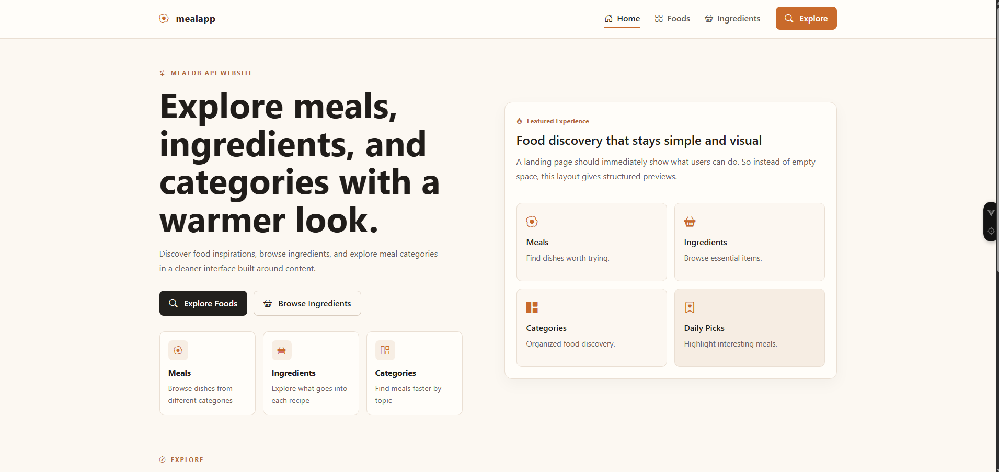
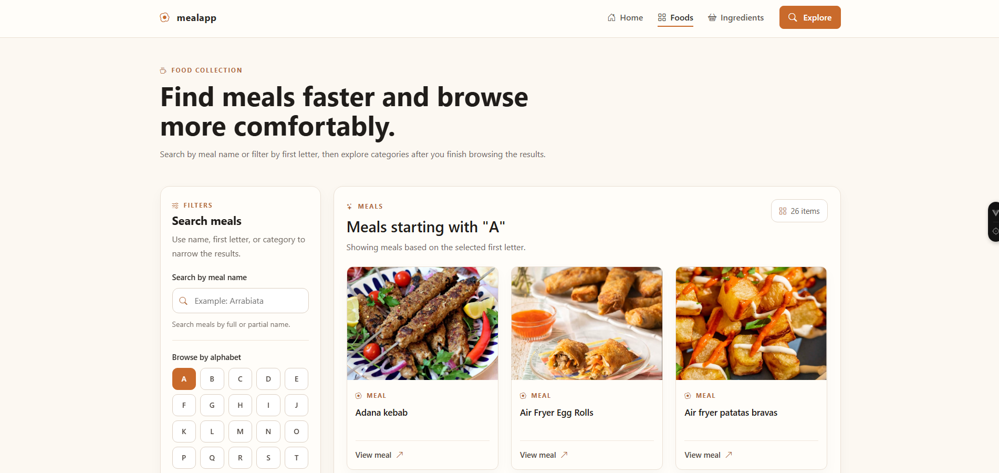
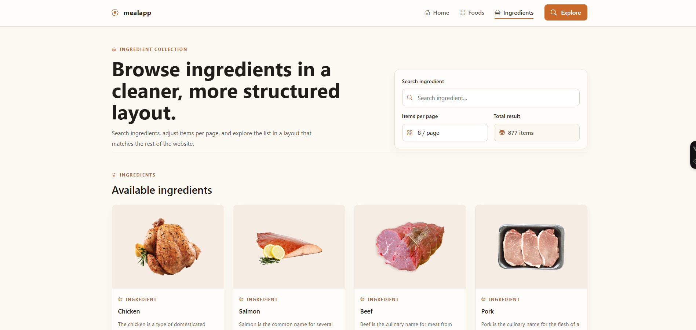
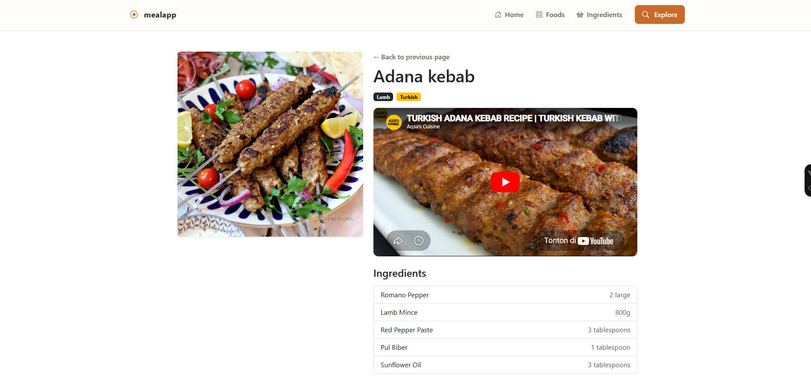
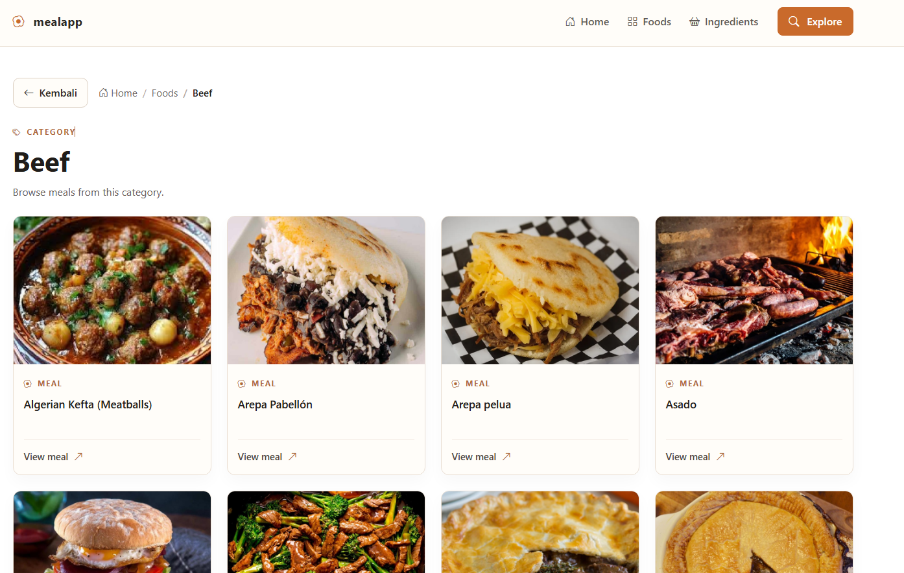
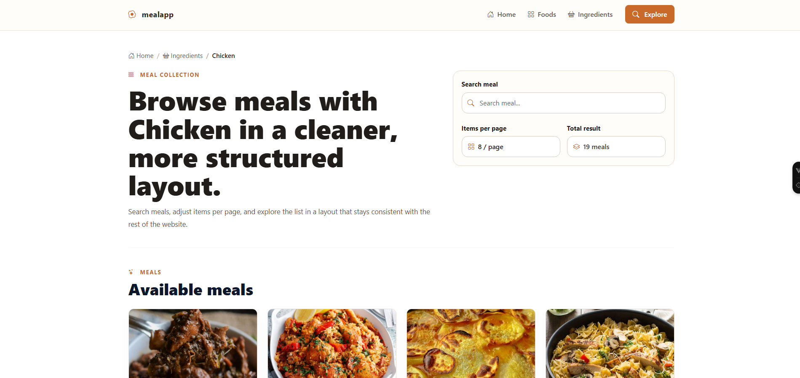

# Food App

Aplikasi katalog makanan berbasis **Vue 3 + Vite** untuk menelusuri data meal secara interaktif. Pengguna dapat mencari meal berdasarkan nama, huruf awal, ingredient, melihat daftar kategori dan ingredient, serta membuka halaman detail meal.

## Fitur Utama

- **Search by meal name** untuk mencari meal berdasarkan nama lengkap atau sebagian kata.
- **Browse by alphabet** A-Z untuk menampilkan meal berdasarkan huruf awal.
- **Browse by category** untuk melihat meal per kategori.
- **List ingredients** untuk menelusuri ingredient yang tersedia.
- **Search by ingredient name** untuk mencari ingredient tertentu.
- **Meal detail page** untuk melihat informasi detail dari setiap meal.
- **Pagination** pada daftar hasil agar navigasi data lebih nyaman.
- **Routing** dengan Vue Router untuk perpindahan antarhalaman.
- **Service layer** terpisah untuk pengambilan data API.

## Teknologi yang Digunakan

Proyek ini menggunakan stack berikut dari `package.json`:

- **Vue 3**
- **Vite**
- **Vue Router**
- **Axios**
- **Bootstrap 5**
- **Bootstrap Icons**

## Requirements

- **Node.js**: `^20.19.0 || >=22.12.0`
- **npm** sesuai instalasi Node.js

## Instalasi

```bash
git clone https://github.com/aderamadhana/cmlabs-frontend-fulltime-test.git
cd your_folder_clone_repo_name

npm install      # install dependencies
npm run dev      # menjalankan development server
```

## Screenshots

### Home Page



### Meals Page



### Ingredients Page



### Meal Detail Page



### Food by Category



### Meal by Ingredients


